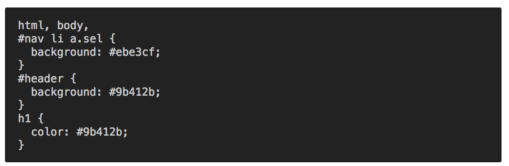
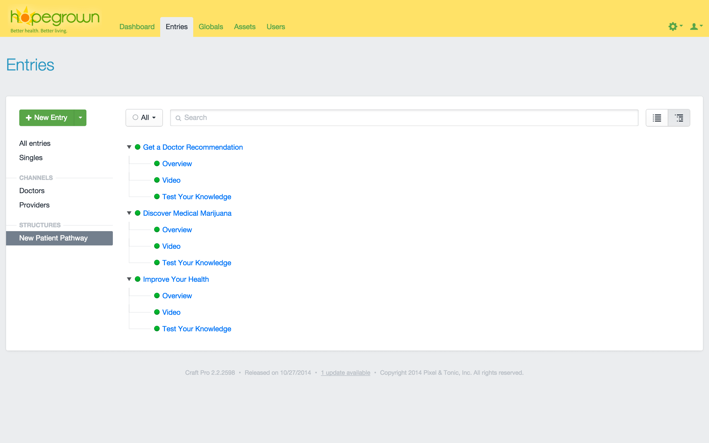
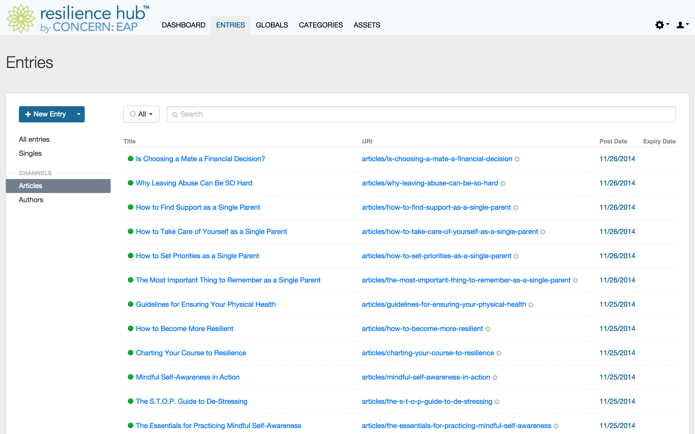
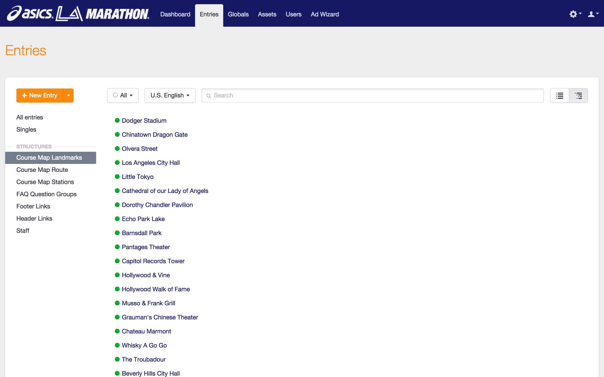

Control Panel CSS plugin for Craft CMS
======================================

Easily overwrite the default Control Panel styles that ship with Craft.

After you've installed the plugin, go to:

- **Settings > Plugins > Control Panel CSS**

Your custom CSS can be saved in either (or both) of two places:

**1) An external file in your public directory...**

**2) The "Additional CSS" field on the settings page...**

You can now customize the CSS in any way you see fit!

***

***

##Real-World Examples

See how other people are using custom CSS in their control panels...

