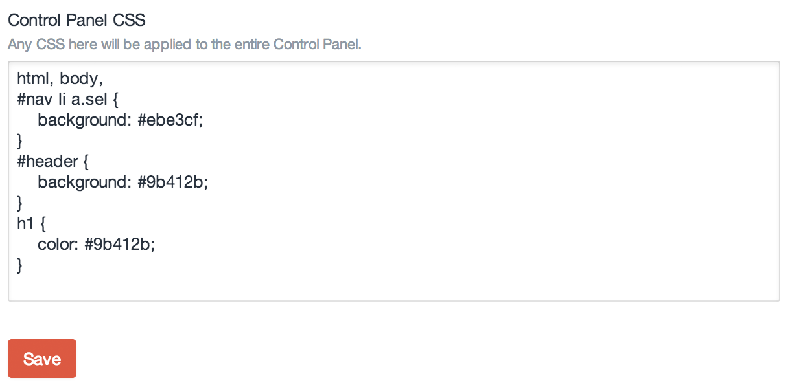

Control Panel CSS
=================

Once you've installed the plugin, go to:

- Settings > Plugins > Control Panel CSS

Enter any CSS you'd like... You are simply overwriting the default Control Panel styles that ship with Craft.

You are now free to customize the CSS of the Control Panel in any way you see fit!

