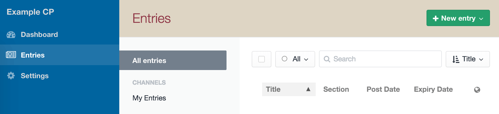
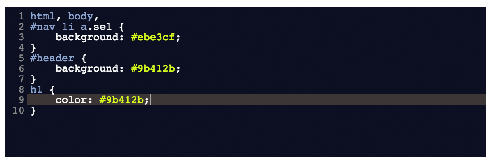

Control Panel CSS plugin for Craft CMS
======================================

Easily overwrite the default Control Panel styles that ship with Craft.

***

>This version is for Craft 2. To install it, download and move the `cpcss` folder into your `craft/plugins` directory.
>
>For the Craft 3 version, see the [`v2` branch...](https://github.com/doublesecretagency/craft-cpcss/tree/v2)

***

After you've installed the plugin, go to:

- **Settings > Plugins > Control Panel CSS**

Your custom CSS can be saved in either (or both) of two places:

**1) An external file in your public directory...**

**2) The "Additional CSS" field on the settings page...**

You can now customize the CSS in any way you see fit!

***

## Starter Code

Customizing your CSS is pretty easy. But to make it even easier, here's a Gist to help you get started:

[Standard Craft Control Panel CSS](https://gist.github.com/lindseydiloreto/50643ea5635b4e8aaa74)
