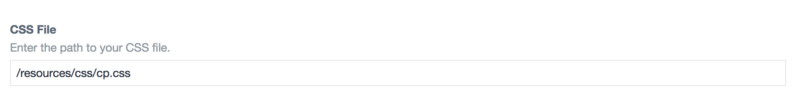

Control Panel CSS plugin for Craft CMS
======================================

Easily overwrite the default Control Panel styles that ship with Craft.


***

After you've installed the plugin, go to:

- **Settings > Plugins > Control Panel CSS**

Your custom CSS can be saved in either (or both) of two places:

**1) An external file in your public directory...**


**2) The "Additional CSS" field on the settings page...**


You can now customize the CSS in any way you see fit!

***

## Starter Code

Customizing your CSS is pretty easy. But to make it even easier, here's a snippet to get you started...

```css
/* Sidebar background color */
#global-sidebar {
    background: #333f4d;
}

/* Header background color */
#main-container #main #header {
    background: #ebedef;
}

/* H1 tags */
h1 {
    color: #29323d;
}

/* Standard button color */
.btn.submit {
    background: #da5a47;
}
/* Hover button color */
.btn.submit:not(.disabled):not(.inactive):hover,
.btn.submit:not(.disabled):not(.inactive).hover {
    background: #bf503f;
}
/* Active button color */
.btn.submit:not(.disabled):not(.inactive):active,
.btn.submit:not(.disabled):not(.inactive).active {
    background: #8c3b2e;
}
```

And here's the same code as a [Gist...](https://gist.github.com/lindseydiloreto/37332424e0edaef54cabc50c324b0fab)

***

## Anything else?

We've got other plugins too!

Check out the full catalog at [doublesecretagency.com/plugins](https://www.doublesecretagency.com/plugins)
