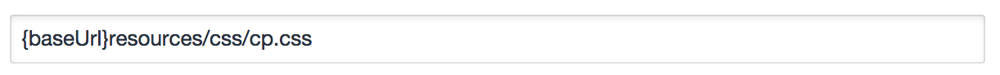

Control Panel CSS plugin for Craft CMS
======================================

Easily overwrite the default Control Panel styles that ship with Craft.

After you've installed the plugin, go to:

- **Settings > Plugins > Control Panel CSS**

Your custom CSS can be saved in either (or both) of two places:

**1) An external file in your public directory...**

**2) The "Additional CSS" field on the settings page...**

You can now customize the CSS in any way you see fit!

***

Here are a few simple examples of how other people are customizing the CSS in their control panels:

[**Hopegrown**](http://www.hopegrown.org/)

[**LA Marathon**](http://www.lamarathon.com/)

**Resilience Hub** _(launching soon)_
